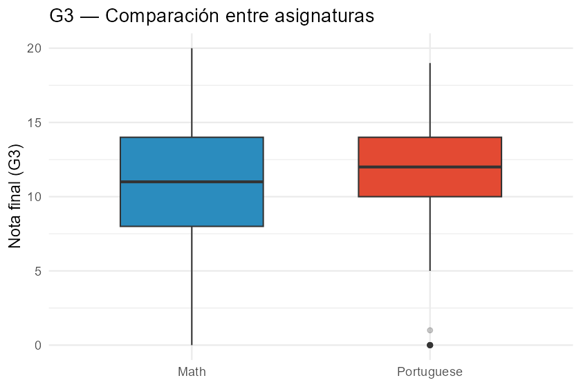
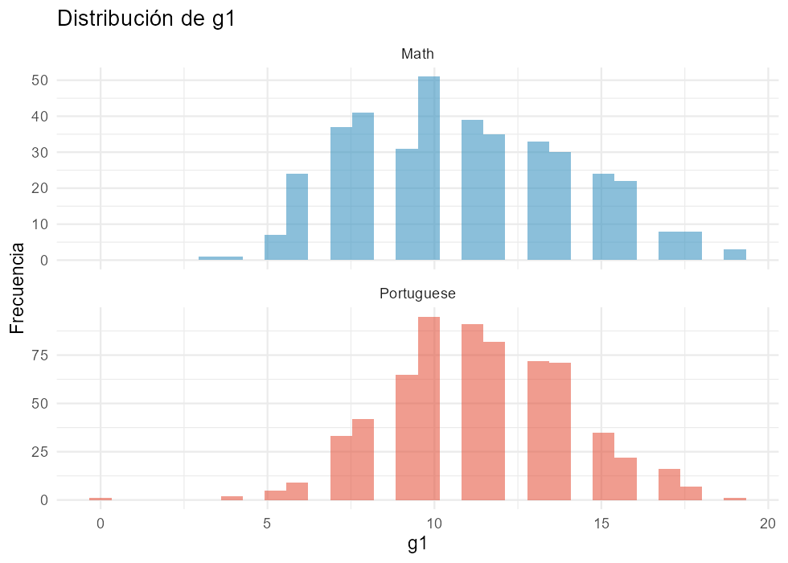
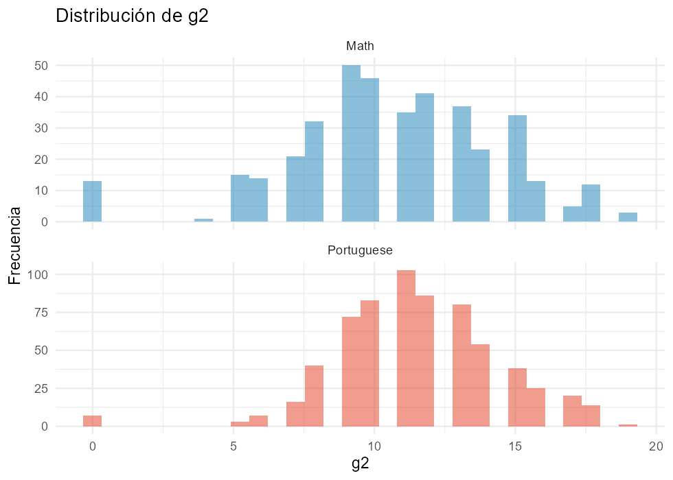
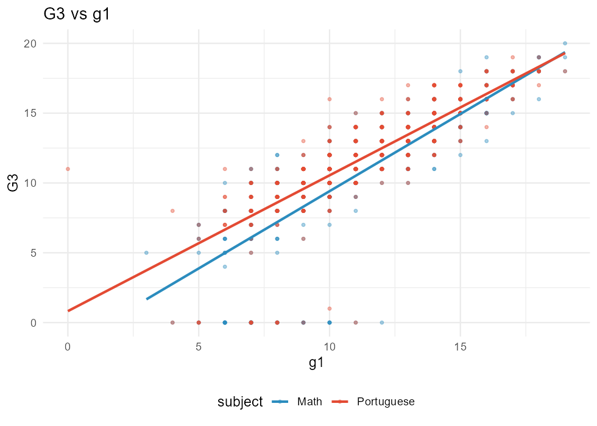
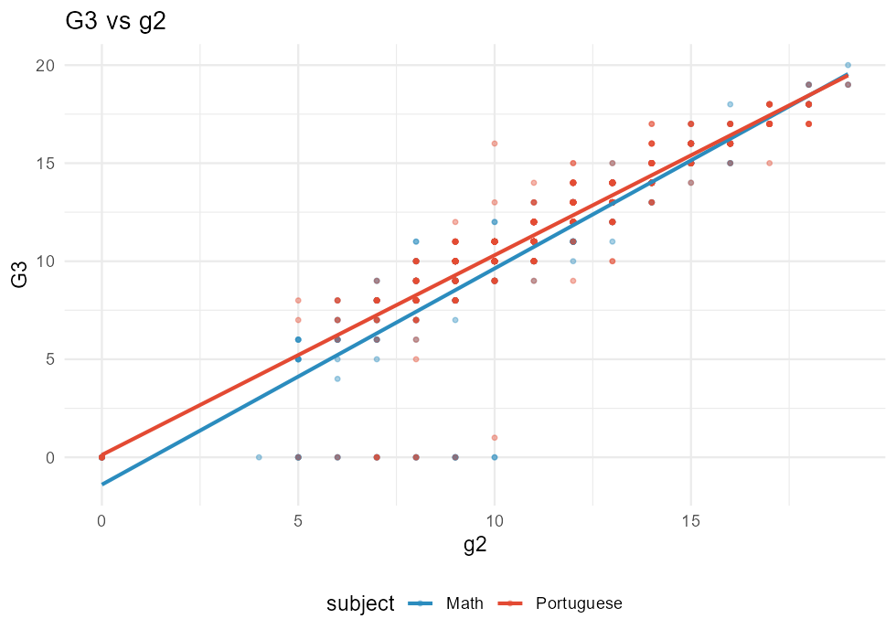
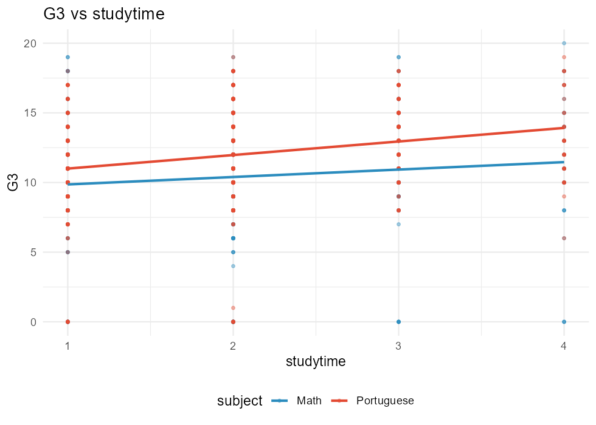
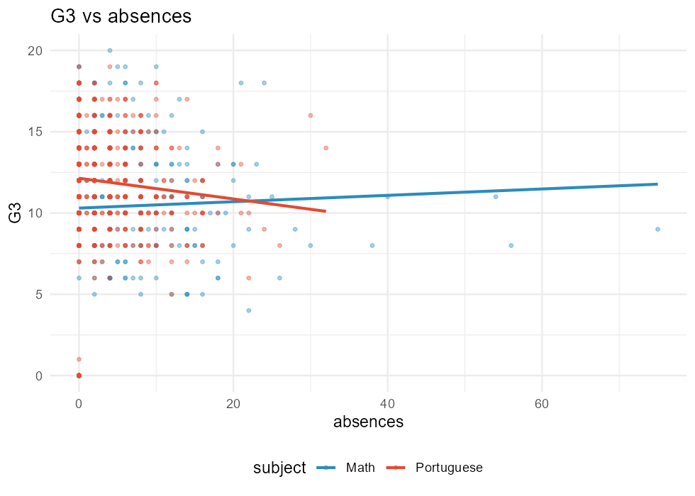
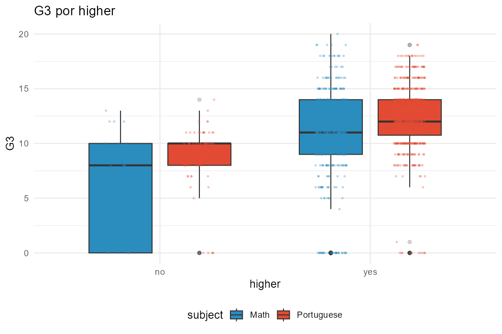
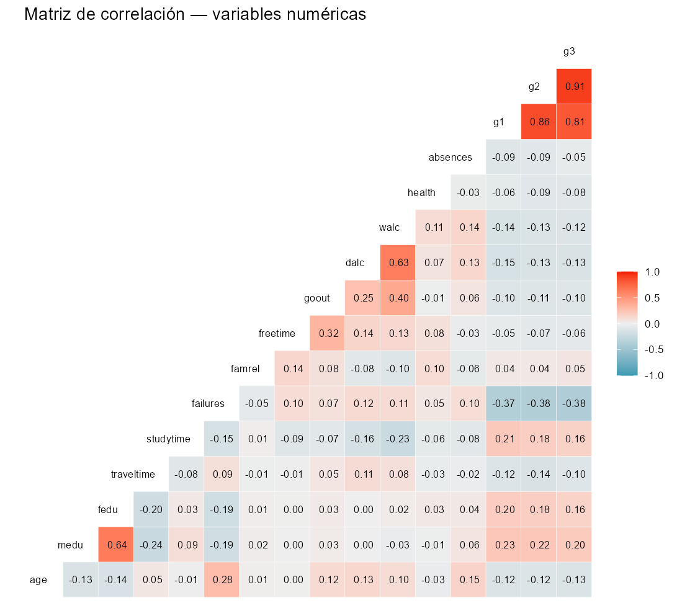
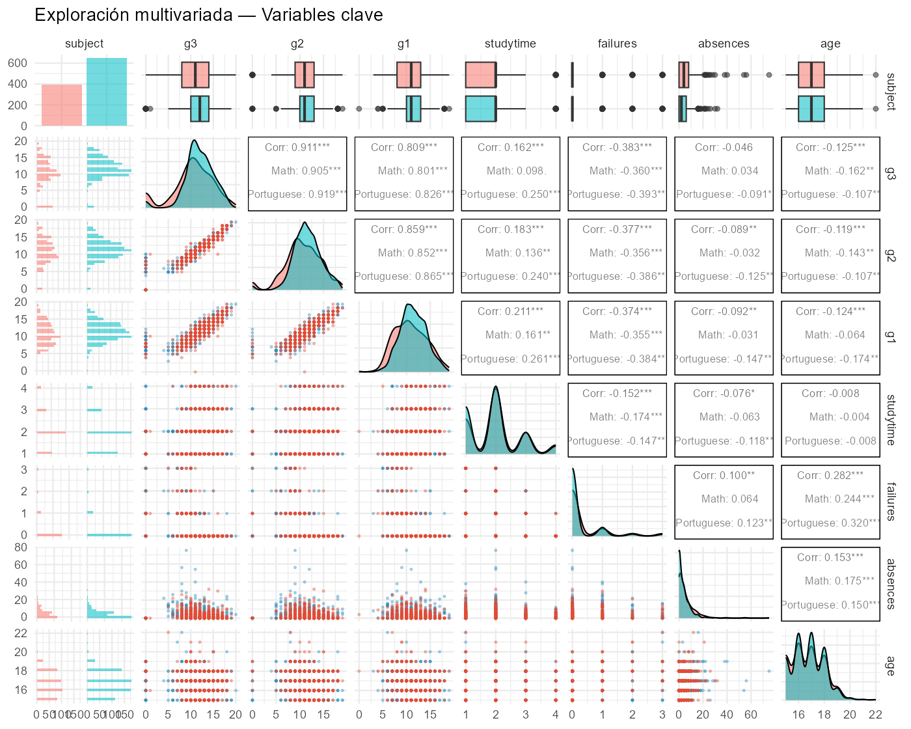

# Análisis Exploratorio de Datos: Student Performance (UCI)

**Autores:** Nino Cabrera, Mateo Chang, Dario Quiroga\
**Fecha:** 11-08-2025\
**Dataset:** Student Performance Data Set — UCI

------------------------------------------------------------------------

## 1. Introducción y Contexto

Este trabajo realiza un **análisis exploratorio de datos (EDA)** utilizando el dataset *Student Performance* publicado por la Universidad de California Irvine (UCI).\
La base contiene información de estudiantes portugueses de secundaria en dos asignaturas: **Matemáticas** y **Lengua Portuguesa**, recolectada durante 2005–2006.

Incluye 33 variables relacionadas con aspectos: - **Demográficos:** edad, sexo, dirección.\
- **Socioeconómicos:** educación de los padres, ocupación, acceso a internet.\
- **Académicos:** tiempo de estudio, ausencias, reprobaciones previas, notas G1, G2 y nota final G3.\
- **Familiares/personales:** apoyo escolar, consumo de alcohol, actividades, relaciones.

### Objetivo

-   Describir las características principales de los estudiantes.\
-   Comparar el rendimiento en Matemáticas y Portugués.\
-   Identificar factores asociados al éxito o fracaso escolar.\

------------------------------------------------------------------------

## 2. Preparación de los Datos

-   **Número de observaciones:** 1044 estudiantes
    -   Matemáticas: 395\
    -   Portugués: 649\
-   **Variables categóricas:** 15\
-   **Variables numéricas:** 16\
-   **Valores perdidos:** no se detectaron.

📄 Tabla resumen: [`tables/01_descripcion_dataset.csv`](tables/01_descripcion_dataset.csv)

------------------------------------------------------------------------

## 3. Análisis Univariado

### 3.1 Rendimiento Final (G3)

-   Matemáticas: media ≈ 10.4, mayor dispersión.\
-   Portugués: media ≈ 11.9, más concentrado.

📊 Figura:\

------------------------------------------------------------------------

### 3.2 Notas Intermedias: G1 y G2

**Distribuciones univariadas:**

\

📄 Tabla con estadísticos: [`tables/02a_univariado_g1_g2_por_materia.csv`](tables/02a_univariado_g1_g2_por_materia.csv)

**Interpretación breve:** G2 suele ser igual o mayor que G1. En Portugués la distribución es más homogénea, mientras que en Matemáticas hay mayor variabilidad.

------------------------------------------------------------------------

### 3.3 Otras variables numéricas

-   **Tiempo de estudio:** mayoría ≤ 2 horas semanales.\
-   **Ausencias:** distribución sesgada, pocos estudiantes concentran muchas faltas.\
-   **Reprobaciones previas:** mayoría sin repitencias, pero existen casos con 3 o más.

------------------------------------------------------------------------

### 3.4 Variables categóricas

-   **Sexo:** ligera mayoría femenina en Portugués.\
-   **Acceso a internet:** mayoritario (\>70%).\
-   **Apoyo escolar:** minoritario (\<15%).

📄 Frecuencias: [`tables/03_frecuencias_categoricas_por_materia.csv`](tables/03_frecuencias_categoricas_por_materia.csv)

------------------------------------------------------------------------

## 4. Análisis Bivariado

### 4.1 G3 vs variables numéricas clave

-   **G1 y G2** correlacionan fuertemente con G3.\
-   **Reprobaciones (failures):** relación negativa clara.\
-   **Tiempo de estudio:** relación positiva moderada.\
-   **Ausencias:** mayor número de faltas, menor rendimiento.

📊 Figuras:\
\
\
\

------------------------------------------------------------------------

### 4.2 G1 y G2: Progresión y cambios

-   **Progresión G1 → G2 → G3**:\
    

-   **Cambios entre periodos (Δ)**:\
    \
    📄 Tabla: [`tables/04a_deltas_g2_g1_g3.csv`](tables/04a_deltas_g2_g1_g3.csv)

**Interpretación breve:** en promedio, G2 ≥ G1. El salto hacia G3 es más heterogéneo en Matemáticas que en Portugués.

------------------------------------------------------------------------

### 4.3 G3 vs variables categóricas

-   **Higher (aspira a estudios superiores):** notas más altas.\
-   **Internet:** acceso favorece mejores calificaciones.\
-   **Apoyo escolar:** resultados mixtos.

📊 Ejemplo:\

------------------------------------------------------------------------

## 5. Análisis Multivariado

### 5.1 Matriz de correlaciones

📄 Tabla: [`tables/05_correlacion_numericas_global.csv`](tables/05_correlacion_numericas_global.csv)

### 5.2 Panel exploratorio

------------------------------------------------------------------------

## 6. Éxito y Fracaso Académico

Se define aprobado cuando **G3 ≥ 10**.

-   Matemáticas: 67.1% aprueba.\
-   Portugués: 84.6% aprueba.

📄 Tabla: [`tables/04_tasas_aprobacion_por_materia.csv`](tables/04_tasas_aprobacion_por_materia.csv)

------------------------------------------------------------------------

## 7. Conclusiones

1.  El rendimiento es superior en Portugués y más homogéneo, mientras que Matemáticas presenta mayor dispersión.\
2.  Las notas previas (G1 y G2) son los mejores predictores de G3.\
3.  Las reprobaciones y ausencias son indicadores de riesgo académico.\
4.  Variables de recursos (internet, aspiraciones de estudios superiores) influyen de manera positiva.\
5.  Matemáticas requiere mayor refuerzo pedagógico comparado con Portugués.

------------------------------------------------------------------------

## 8. Referencia

Cortez, P. & Silva, A. (2008). *Using Data Mining to Predict Secondary School Student Performance*.\
In A. Brito and J. Teixeira (Eds.), Proceedings of 5th Future Business Technology Conference (FUBUTEC 2008), Porto, Portugal. EUROSIS.

